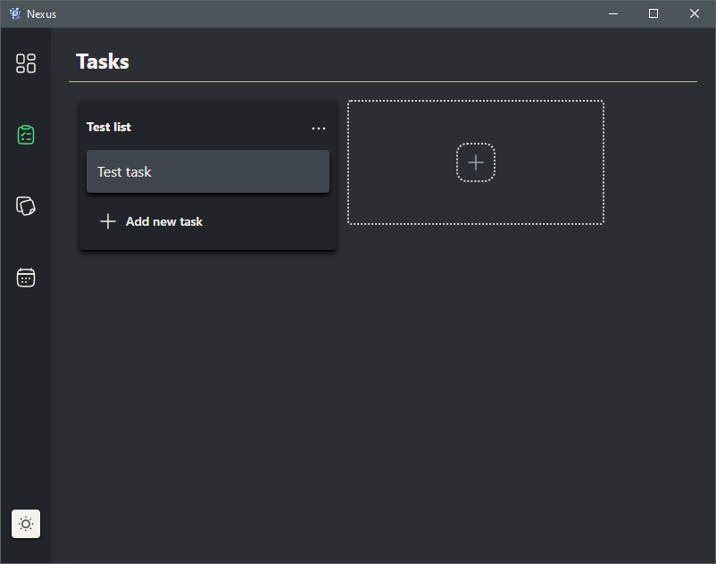

# Nexus

This is an app to manage tasks like Trello, create notes and create events in a calendar.



## Recommended IDE Setup

[VS Code](https://code.visualstudio.com/) + [Tauri](https://marketplace.visualstudio.com/items?itemName=tauri-apps.tauri-vscode) + [rust-analyzer](https://marketplace.visualstudio.com/items?itemName=rust-lang.rust-analyzer) + [Angular Language Service](https://marketplace.visualstudio.com/items?itemName=Angular.ng-template).

## Usage

To use this application, you should have installed **Rust** and **npm**.

If you've already installed the required software, just clone this repo and build the app using:

```
npm run tauri build
```

## Contributing

Pull requests are welcome. For major changes, please open an issue first to discuss what you would like to change.